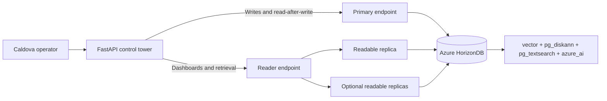

# Caldova Logistics on Azure HorizonDB

Caldova Control Tower is a working logistics operations application and a five-part demonstration of Azure HorizonDB:

1. **This is PostgreSQL.** Use familiar SQL, JSONB, full-text search, constraints, transactions, `RETURNING`, and `EXPLAIN`.
2. **Scale and availability are built for Azure.** Send writes to the primary endpoint and read-heavy tracking/search traffic to the reader endpoint backed by readable replicas.
3. **PostgreSQL can power the AI data path.** Use DiskANN vector search, BM25 keyword search, reciprocal rank fusion, and grounded generation through HorizonDB AI extensions.
4. **Agents can work through governed PostgreSQL tools.** Use a remote MCP server and a least-privilege PostgreSQL role for fixed, read-only workflows.
5. **The complete service can be operated and observed.** Generate a recognizable workload and inspect it with the VS Code PostgreSQL dashboard and Azure Monitor.

The running incident is a temperature-sensitive shipment delayed at the Denver hub. An operator observes the exception, locates qualified handling guidance, and produces a grounded response briefing.

> **Talk message:** Azure HorizonDB is the PostgreSQL you know and love, powered by the scale, security, and availability of Azure.

## Architecture



The application is intentionally conventional: Python 3.11+, FastAPI, server-rendered Jinja templates, and psycopg 3 connection pools. There is no separate frontend toolchain.

## Repository Layout

| Path | Purpose |
| --- | --- |
| `app/` | FastAPI application, HTML/CSS, repository layer, and HTTP tests |
| `scripts/` | Cluster lifecycle, firewall, installation, test, run, verify, and teardown |
| `sql/00-schema-and-seed.sql` | Core PostgreSQL schema and deterministic logistics data |
| `sql/01-this-is-postgresql.sql` | JSONB, full-text search, `RETURNING`, and `EXPLAIN` demo |
| `sql/02-scale-and-ha.sql` | Primary/reader endpoint identity and read workload demo |
| `sql/03-enable-ai.sql` | Preview extensions, embeddings, BM25, and DiskANN setup |
| `sql/04-ai-hybrid-search.sql` | Hybrid RRF retrieval and grounded briefing demo |
| `sql/05-verify.sql` | Database objects, data, extensions, and index checks |

## Prerequisites

- PowerShell 7 or Windows PowerShell 5.1.
- Python 3.11 or later on `PATH`.
- Azure CLI signed in to the intended subscription.
- Azure CLI HorizonDB commands available (`az horizondb --help`).
- The Microsoft PostgreSQL extension for VS Code.
- Visual Studio Code 1.102 or later with `pgsql.copilot.enable` set to `true` for the extension's built-in **PostgreSQL MCP** server.
- An Azure subscription permitted to create HorizonDB resources.
- For Demo 3, access to the HorizonDB AI extension preview and a supported embedding/generation model configuration.

Do not put a database password in tracked files. For repeated local rehearsals,
`pwd.env` is ignored by Git and may contain:

```text
CALDOVA_DATABASE_PASSWORD=<password>
```

Preflight and the Demo 5 workload read this file when present and otherwise
prompt securely. The password is plaintext on the local machine, so do not copy
`pwd.env` to another computer or share it.

## Build the Environment

Run the single presenter-facing preflight from the repository root:

```powershell
./scripts/00-preflight.ps1 -Subscription 'AzureSQL_bobward'
```

It checks the full demo environment and repairs safe missing pieces: firewall rules, password-free endpoint configuration, local dependencies, base database objects, seed data, and application tests. It reads the ignored local `pwd.env` file when configured and otherwise prompts securely for the database password.

If the cluster is missing, explicitly approve billable Azure provisioning:

```powershell
./scripts/00-preflight.ps1 `
    -Subscription 'AzureSQL_bobward' `
    -ApproveProvisioning
```

The defaults create PostgreSQL 17 with one readable replica in `westus3`, add firewall rules for the presenter's current public IP and Azure-hosted PostgreSQL MCP connections, verify the cluster, and print password-free connection details. One standby is the minimum topology used by this demo for readable scale-out and high availability.

The MCP rule uses HorizonDB's documented `0.0.0.0` to `0.0.0.0` convention for Azure-hosted services. It does not allow the entire public internet. PostgreSQL roles and permissions remain the database enforcement boundary.

All deployment values are parameters:

```powershell
./scripts/00-preflight.ps1 `
    -Subscription 'AzureSQL_bobward' `
    -ResourceGroup 'caldova-logistics-rg' `
    -ClusterName 'caldova-logistics' `
    -Location 'westus3' `
    -VCores 2 `
    -ReplicaCount 1 `
    -ApproveProvisioning
```

Preflight preserves an existing cluster. Use `-ResetDatabase` only when you explicitly intend to drop and recreate the four Caldova-owned tables from `sql/00-schema-and-seed.sql`.

## Move to Another Computer

Clone or copy this repository; do not copy `.venv`, `.caldova-connection.json`,
`.env`, `pwd.env`, saved VS Code profiles, or passwords. Those files and
credentials are machine-specific.

On the new Windows machine:

1. Install Git, VS Code, Python 3.11 or later, Azure CLI, Azure Developer CLI,
   Microsoft Edge, and the PostgreSQL 17 Command Line Tools. On Windows,
   `pgbench` is supplied by the PostgreSQL package distributed through the
   EnterpriseDB installer:

```powershell
winget install --id PostgreSQL.PostgreSQL.17 --exact --source winget
pgbench --version
```

The expected version is PostgreSQL 17 or later. You do not need to initialize a
local PostgreSQL server or run `pgbench -i` for this demo.

1. Run `az login` and select the intended tenant and subscription.
1. Run the parent preflight to recreate `.venv`, endpoint metadata, firewall
    access, and the base database:

```powershell
./scripts/00-preflight.ps1 -Subscription 'AzureSQL_bobward'
```

1. Prepare Demo 4. Enter the HorizonDB administrator password and desired
    `caldova_agent` password directly into the terminal. This resets only the
    rehearsal recovery artifacts and synchronizes the encrypted Function
    credential when the Function already exists:

```powershell
./demo4-agent-mcp/scripts/00-preflight.ps1
```

1. Recreate local azd state and repair/deploy the remote MCP server if needed.
    Enter the same `caldova_agent` password:

```powershell
./demo4-agent-mcp/scripts/01-deploy-remote-mcp.ps1 -Approve
```

1. Resolve the active Foundry Hosted Agent Responses endpoint into the current
    PowerShell process, then start the app. The runner performs the endpoint
    resolution automatically when needed:

```powershell
./demo4-agent-mcp/scripts/02-connect-app.ps1
./scripts/05-run-app.ps1 -Port 8010
```

1. Open the app in a standalone Edge app window, not VS Code's integrated
    browser:

```powershell
msedge.exe --app=http://127.0.0.1:8010 --start-maximized
```

Preflight installs the HorizonDB Azure CLI extension and Microsoft PostgreSQL VS Code extension when their command-line hosts are available. It recreates `.venv`, regenerates password-free endpoint configuration from Azure, refreshes firewall access for the new machine, validates both endpoints, and checks or deploys the database.

After preflight, create the two machine-local VS Code connection profiles, **Caldova Primary** and **Caldova Reader**, using the endpoints printed by `03-show-connection.ps1`. Enter the password directly into VS Code. The extension stores profiles and credentials locally, so they do not travel with the repository.

The remaining numbered scripts can also be run separately for repair or rehearsal.

### Firewall Repair

```powershell
./scripts/02-add-firewall-rule.ps1 `
    -Subscription 'AzureSQL_bobward' `
    -AllowAzureServicesForMcp
```

The script discovers the current public IPv4 address and creates a single-address firewall rule. Use `-IPAddress` to supply one explicitly.

### Connection Details

```powershell
./scripts/03-show-connection.ps1 -Subscription 'AzureSQL_bobward'
```

Create two connections in the Microsoft PostgreSQL extension:

- **Caldova Primary:** primary endpoint, database `postgres`, SSL required.
- **Caldova Reader:** reader endpoint, database `postgres`, SSL required.

Let the extension prompt for the password. Do not add it to source files.

The in-app agent does not require a saved VS Code PostgreSQL profile. It uses a
remote Azure Functions MCP server. VS Code profiles remain useful for the SQL
editor and database dashboard demonstrations.

### Database Setup

Preflight uses the installed `psycopg` client to validate both endpoints and deploy `sql/00-schema-and-seed.sql` when the base schema is absent. The canonical SQL file remains the repeatable source of truth. PostgreSQL MCP remains the live Demo 4 experience, not a prerequisite for provisioning the database.

### Install and Test the App

```powershell
./scripts/04-install-app.ps1
./scripts/06-test-app.ps1
```

This creates `.venv` inside the repository and runs tests without requiring a live database.

### Run the App

Preflight writes `.caldova-connection.json` with password-free endpoint metadata. The run script reads it and prompts securely for the password:

```powershell
./scripts/05-run-app.ps1
```

Open `http://127.0.0.1:8010` in Microsoft Edge.

## Demo Runbook

### Demo 1: This Is PostgreSQL

Use one connected editor, one application window, and this locked sequence:

1. Open Caldova Control Tower and identify delayed shipment `CLD-2026-0911-001` and its temperature alert.
2. Open `sql/01-this-is-postgresql.sql` in the Microsoft PostgreSQL extension using **Caldova Primary**.
3. Run the first two statements. Point out PostgreSQL 17, database `postgres`, and the ordinary PostgreSQL login.
4. Run the shipment and facility queries. Show relational joins plus JSONB cargo and capability attributes.
5. Run the `INSERT ... ON CONFLICT ... RETURNING` statement for `CLD-2026-DEMO-003`. It is safe to rehearse repeatedly and must return one logical shipment.
6. Run the full-text query and `EXPLAIN (ANALYZE, BUFFERS)`. Show PostgreSQL-native weighted text search before introducing vectors.
7. Submit the same tracking number from the application. Refresh and confirm there is still one `CLD-2026-DEMO-003` shipment.

Expected proof:

- The application uses Python, FastAPI, psycopg 3, and standard PostgreSQL connection strings.
- PostgreSQL SQL, transactions, constraints, JSONB, `RETURNING`, full-text search, and query plans work without a HorizonDB-specific SDK.
- Repeating the demo is idempotent: `CLD-2026-DEMO-003` remains a single row.

### Demo 2: Scale and Make It Highly Available

1. Run `sql/02-scale-and-ha.sql` through the primary connection and note the read-write endpoint behavior.
2. Run it through several fresh reader connections and compare server address, backend PID, and read-only state. Do not use `pg_is_in_recovery()` as the replica-role proof; HorizonDB replicas use stateless compute over shared storage rather than traditional PostgreSQL streaming recovery.
3. Explain the application routing: mutations use `WRITE_DATABASE_URL`; dashboards and retrieval use `READ_DATABASE_URL`.
4. In Azure, show the shared-storage replica topology and stable primary/reader endpoints.
5. For a rehearsed failover, keep the application pointed at the stable endpoints, initiate the approved failover operation, and refresh after reconnection. Do not change application connection strings during the demonstration.

The reader endpoint balances **connections**, not individual statements. Open new reader sessions when demonstrating distribution.

### Demo 3: PostgreSQL-Native AI Retrieval and Model Pipelines

The native ingestion pipeline is ready. It uses a manually registered Microsoft
Foundry `text-embedding-3-small` deployment, so AI Model Management is not
required. Live cited generation remains gated because this subscription has no
real-time chat-model quota.

Before the session:

1. Run `demo3-ai-pipeline/scripts/00-preflight.ps1 -Subscription 'AzureSQL_bobward'` and require exit code 0.
2. Confirm the Foundry deployment `caldova-embedding` is `Succeeded`.
3. Confirm `caldova-guide-pipeline` is completed with eight processed guides.
4. Confirm `operations_guide_chunk` contains eight non-null, 1,536-dimensional embeddings and its DiskANN index.

During the demo:

1. Show eight authoritative rows in `operations_guide`.
2. Open **Pipelines & Workflows** in the PostgreSQL extension and select `caldova-guide-pipeline`.
3. Show table source → chunk → embed → table sink, with the Microsoft Foundry call as the external node.
4. Run `demo3-ai-pipeline/sql/03-replay-pipeline.sql` and watch the durable graph move from running to completed.
5. Run `demo3-ai-pipeline/sql/02-run-and-verify.sql` and prove eight chunks, eight embeddings, 1,536 dimensions, and DiskANN.
6. Emphasize that source rows, pipeline state, retries, output, and indexes remain governed with PostgreSQL data.

For the keynote tease, stop after the graph and populated sink. The breakout can
continue later into semantic/hybrid retrieval after that path is separately
validated.

Production pipeline decisions:

- Treat embeddings as derived data and track their source-content and model versions.
- Make ingestion and re-embedding restartable and idempotent.
- Evaluate retrieval quality, groundedness, latency, and cost before changing a deployed model or prompt.
- Keep embedding work outside the shipment transaction and track the Foundry deployment alias used for every run.

### Demo 4: In-App Agent with Remote MCP

For the complete architecture, security model, database objects, two-phase
request lifecycle, idempotency rules, secret handling, source map, and
clean-laptop commands, see
[`demo4-agent-mcp/README.md`](demo4-agent-mcp/README.md).

This demo stays inside Caldova Control Tower. FastAPI calls a portal-visible
Microsoft Foundry Hosted Agent over the Responses protocol using the current
Microsoft Entra identity. The hosted Agent Framework service can call five fixed
tools on the Azure Functions MCP server. Three gather evidence. One proposes a
recovery plan. One executes only after the app supplies an operator approval
token.

Preflight:

1. Run `demo4-agent-mcp/scripts/00-preflight.ps1` and require success.
2. Run `demo4-agent-mcp/scripts/01-deploy-remote-mcp.ps1 -Approve` when deployment or repair is needed.
3. Run `demo4-agent-mcp/scripts/02-connect-app.ps1` to verify the active Hosted Agent endpoint, or let `scripts/05-run-app.ps1` do this automatically.
4. Start Caldova Control Tower and confirm **Ask Caldova Agent** appears.

Live question:

```text
Investigate shipment CLD-2026-0911-001. Explain the cold-chain incident using
measured facts, find a capable facility, and recommend the approved handling
response.
```

The presenter does not type this text. Select **Investigate & propose** beside
the Critical incident; the app submits the locked goal automatically. Keep
**Ask Agent** for optional free-form questions.

Expected tool flow:

1. **get_cold_chain_incident**
2. **find_cold_storage_facilities**
3. **get_handling_guidance**
4. **propose_recovery_plan**
5. Operator selects **Approve & execute** in the app.
6. **execute_approved_recovery_plan**
7. App verifies quality hold `Placed`, transfer `Ready`, notification `Queued`,
   and plan `Executed`.

The model cannot approve its own plan. The app calls the admin-only approval
function, keeps the approval token server-side, and gives it to a fresh agent
execution turn. `caldova_agent` has `SELECT` on four curated views and `EXECUTE`
only on proposal and guarded-execution functions. It cannot approve a plan or
write underlying tables directly. PostgreSQL permissions and function checks,
not MCP annotations, are the enforcement boundary.

### Demo 5: Production Evidence and the Complete Prototype

1. Open the **Caldova Primary** and **Caldova Reader** PostgreSQL dashboards in
    VS Code and select **Sessions** on both.
1. Run the controlled four-lane pgbench workload:

```powershell
./scripts/08-run-workload.ps1 `
     -DurationSeconds 90 `
     -ClientsPerLane 10 `
     -ThreadsPerLane 2 `
     -ProgressSeconds 5
```

1. Filter the dashboard **Application** column for `caldova-demo5`. Reader
    shows tracking and guidance lanes; Primary shows control and temporary-write
    lanes.
1. Use **Overview**, **Queries**, **Waits**, and **Sessions** to connect live
    evidence to TLS, primary/reader routing, backups, failover, and bounded
    retries. Do not claim Private Link or Entra are configured when they are not.
1. Return to the application and show the complete incident workflow.
1. Close on the architecture decision: the PostgreSQL contract remains reusable
    while HorizonDB supplies the Azure scale, availability, and operational
    foundation.

The pgbench scripts use custom SQL only. They never run `pgbench -i`. The
primary write lane uses a session-local temporary table, so Demo 5 leaves no
persistent workload data and does not change Demos 1–4. The workload reads the
database password from ignored local `pwd.env` when present and prompts when it
is absent.

## Verification

Run the same single preflight again. It is idempotent unless `-ResetDatabase` is supplied:

```powershell
./scripts/00-preflight.ps1 -Subscription 'AzureSQL_bobward'
```

Verify the Azure control plane:

```powershell
./scripts/07-verify-cluster.ps1 -Subscription 'AzureSQL_bobward'
```

Then run `sql/05-verify.sql` using the primary connection. Expected baseline counts after setup are:

| Object | Minimum rows |
| --- | ---: |
| `facility` | 5 |
| `shipment` | 2 |
| `shipment_event` | 2 |
| `operations_guide` | 8 |

The extension and embedding checks are expected only after `sql/03-enable-ai.sql` succeeds.

## Teardown

Teardown deletes the entire configured resource group and requires an explicit switch:

```powershell
./scripts/99-teardown.ps1 `
    -Subscription 'AzureSQL_bobward' `
    -ConfirmDelete
```

Use `-ResourceGroup` if the deployment used a non-default name. Review that value before running the command.

## Moving to Its Own Repository

This folder has no runtime dependency on its parent directory. Initialize and publish it independently when ready:

```powershell
Set-Location horizondb/caldovalogistics
git init
git add .
git commit -m 'Build Caldova Logistics HorizonDB demo'
```

Review staged files before committing. `.env`, `.env.local`, `.venv`, caches, and build outputs are already ignored.
