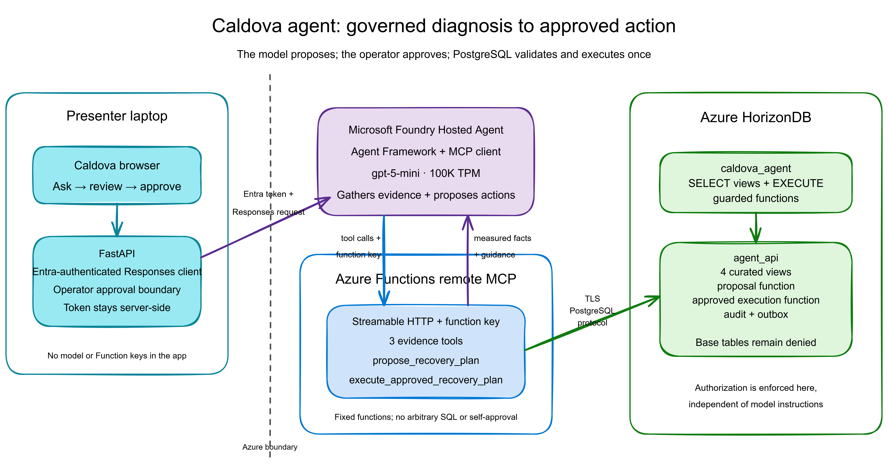

# Demo 4: In-App Agent with Remote MCP

This demo gives the Caldova FastAPI application a portal-visible Microsoft
Foundry Hosted Agent built with Microsoft Agent Framework and backed by
`gpt-5-mini`. The hosted agent can call five fixed tools on a remote MCP server
hosted by Azure Functions:

- `get_cold_chain_incident`
- `find_cold_storage_facilities`
- `get_handling_guidance`
- `propose_recovery_plan`
- `execute_approved_recovery_plan`

Each tool runs one parameterized query or named PostgreSQL function as
`caldova_agent`. That login can read the curated views and execute proposal or
approved-action functions, but cannot approve a plan or access the underlying
tables directly.



## Prepare Database Security

```powershell
.\scripts\00-preflight.ps1
```

Type the HorizonDB administrator password and a password for `caldova_agent`
directly into the terminal. Neither password is written to disk.

Preflight creates or repairs the curated views and login, then proves:

1. The login can read all four curated views.
2. The login cannot read `public.shipment` directly.
3. The login cannot update `public.shipment`.
4. The login can propose and execute an approved plan.
5. The login cannot approve its own plan.
6. Rehearsal recovery artifacts are reset.
7. The deployed Function credential is synchronized when the Function exists.

## Deploy the Remote Server

Provision the Flex Consumption Function app, Application Insights, storage,
managed identity, and the Foundry chat deployment:

```powershell
.\scripts\01-deploy-remote-mcp.ps1 -Approve
```

Enter the same `caldova_agent` password directly into the terminal. The script
passes it as a secure Bicep parameter and does not write it to the azd
environment or repository.

## Run the In-App Agent

Run the connection script to verify the active Hosted Agent and load only its
Responses endpoint. The app runner also does this automatically:

```powershell
.\scripts\02-connect-app.ps1
..\scripts\05-run-app.ps1
```

Open `http://127.0.0.1:8010`. The critical incident appears immediately above
the agent panel.

The live sequence is:

1. Select **Investigate & propose** beside the Critical incident. The app
   supplies the locked goal automatically; no typing is required.
2. Review the structured **Proposed** recovery plan.
3. Select **Approve & execute**.
4. Confirm the plan is **Executed**, quality hold is `Placed`, transfer is
   `Ready`, and notification is `Queued`.
5. Selecting the action again is safe; execution is idempotent by plan ID.

**Ask Agent** remains available below the incident for free-form exploration.
It uses the same governed tool boundary but is not the primary staged workflow.

## Locked Question

```text
Investigate shipment CLD-2026-0911-001. Explain the cold-chain incident using
measured facts, find a capable facility, and recommend the approved handling
response.
```

Expected flow: FastAPI -> Foundry Hosted Agent -> Agent Framework -> remote MCP
-> `caldova_agent` -> guarded PostgreSQL functions. Approval is a separate
FastAPI-to-HorizonDB call and the token never appears in HTML.

## How It Works Behind the Scenes

### Components

| Component | Responsibility |
| --- | --- |
| Caldova browser | Collects the incident question, displays the proposal, and captures the operator approval click |
| Local FastAPI app | Hosts the UI, invokes the Hosted Agent with Microsoft Entra, owns operator approval, and keeps approval tokens server-side |
| Microsoft Foundry Hosted Agent | Hosts the Agent Framework code, model/tool loop, session runtime, and Responses endpoint |
| Microsoft Agent Framework | Runs inside the hosted service and connects to the remote Streamable HTTP MCP endpoint |
| Microsoft Foundry model | Provides the `caldova-agent-chat` `gpt-5-mini` deployment at 100K TPM |
| Azure Functions | Hosts the five fixed MCP tools and authenticates requests with a Function key |
| `caldova_agent` | Least-privilege PostgreSQL login used by all MCP tools |
| Azure HorizonDB | Stores operational facts, recovery state, audit history, and the notification outbox; enforces authorization and execution rules |

### Phase 1: Diagnose and Propose

1. **Investigate & propose** posts the selected incident's locked goal to
   `POST /agent`. The free-form **Ask Agent** form uses the same route.
2. FastAPI acquires an Entra token for `https://ai.azure.com/.default` and calls
   the active Hosted Agent Responses endpoint. `scripts/02-connect-app.ps1`
   resolves only that endpoint; Function authentication remains inside the
   hosted runtime.
3. The model calls three evidence tools:
   - `get_cold_chain_incident`
   - `find_cold_storage_facilities`
   - `get_handling_guidance`
4. Evidence tools use the HorizonDB **reader endpoint** and query only curated
   `agent_api` views.
5. The model calls `propose_recovery_plan` with the tracking number, selected
   facility, guide ID, and measured rationale.
6. The proposal tool uses the HorizonDB **primary endpoint** and calls
   `agent_api.propose_recovery_plan(...)`.
7. PostgreSQL validates that the shipment is delayed, the facility supports
   cold storage, the guide is approved, and the rationale is present.
8. PostgreSQL creates or reuses one idempotent plan and records
   `PlanProposed` in the audit table.
9. FastAPI reloads the plan through `agent_api.recovery_plan_status` and renders
   a structured **Proposed** card. No approval credential exists yet.

### Phase 2: Approve and Execute

1. The operator selects **Approve & execute**.
2. The browser posts only the plan ID to
   `POST /agent/plans/{plan_id}/approve`.
3. FastAPI uses its normal primary database connection to call the admin-only
   `agent_api.approve_recovery_plan(...)` function.
4. PostgreSQL changes the plan to `Approved`, generates an unguessable UUID
   approval token, records the approver, and writes a `PlanApproved` audit row.
5. The token remains in FastAPI memory. It is never added to HTML, JavaScript,
   URL parameters, browser storage, logs, or model output.
6. FastAPI starts a fresh agent turn and supplies the plan ID and token in the
   execution prompt.
7. The model calls `execute_approved_recovery_plan` exactly once.
8. The remote MCP tool uses the primary endpoint and invokes
   `agent_api.execute_approved_recovery_plan(...)`.
9. PostgreSQL locks the plan row and rejects missing or incorrect tokens.
10. In one database transaction PostgreSQL:
    - Creates one quality-hold shipment event.
    - Creates one cold-storage transfer task for DEN1.
    - Queues one QA/shipper notification in the outbox.
    - Marks the plan `Executed`.
    - Stores the structured execution result.
    - Adds a `PlanExecuted` audit row.
11. FastAPI reloads the authoritative status and displays `Executed`, quality
    hold `Placed`, transfer `Ready`, and notification `Queued`.

`Queued` means the durable notification intent exists in HorizonDB. This demo
does not claim an external email or message was delivered.

### Top Banner Status Semantics

The top incident banner combines three distinct concepts without overwriting
the shipment's transport lifecycle:

| Recovery state | Banner headline | Recovery badge | Shipment table status |
| --- | --- | --- | --- |
| No plan | Cold-chain exception at DEN1 | None | Delayed |
| Proposed | Recovery plan awaiting approval | Proposed | Delayed |
| Approved | Recovery approved for DEN1 | Approved | Delayed |
| Executed | Quality hold placed at DEN1 | Executed | Delayed |

**Critical** remains visible as incident severity throughout. **Delayed** remains
the shipment transport status until a separate logistics workflow actually
changes movement state. The agent action changes operational disposition, not
the underlying meaning of shipment status.

### PostgreSQL Objects

| Object | Purpose |
| --- | --- |
| `agent_api.incident_summary` | Delayed-shipment facts and latest temperature measurement |
| `agent_api.candidate_facility` | Facilities approved for cold storage |
| `agent_api.handling_guide` | Curated operational guidance |
| `agent_api.recovery_plan_status` | Read-only combined plan and execution status |
| `agent_api.recovery_plan` | Proposal, approval, token, and execution state |
| `agent_api.recovery_transfer_task` | Idempotent transfer work item |
| `agent_api.notification_outbox` | Durable notification intent |
| `agent_api.recovery_action_audit` | Proposal, approval, and execution audit trail |
| `agent_api.propose_recovery_plan(...)` | Validates and creates/reuses a proposal |
| `agent_api.approve_recovery_plan(...)` | App-only approval and token generation |
| `agent_api.execute_approved_recovery_plan(...)` | Token-gated atomic execution |
| `agent_api.reset_recovery_demo(...)` | Admin-only rehearsal cleanup |

### Authorization Matrix

| Capability | `caldova_agent` | FastAPI primary login |
| --- | ---: | ---: |
| Read curated views | Yes | Yes |
| Read/write underlying public tables directly | No | Yes |
| Propose a recovery plan | Yes | Yes |
| Approve a recovery plan | **No** | Yes |
| Execute with a valid approval token | Yes | Yes |
| Reset rehearsal state | **No** | Yes |

The model cannot approve its own proposal because the approval function is not
granted to `caldova_agent` and is not exposed as an MCP tool.

### Idempotency and Recovery

- A unique constraint on shipment, facility, and guide prevents duplicate
  recovery plans.
- Transfer and notification tables allow only one row per plan.
- The quality-hold event is inserted only when that plan ID is absent.
- Executing an already executed plan returns its persisted status without
  repeating actions.
- If execution fails after approval, the app displays **Retry execution**. The
  same approved plan can be retried safely.
- **Reset demo** calls the admin-only reset function and removes only artifacts
  associated with the rehearsal plan IDs.

### Secrets and Runtime Configuration

- No passwords, Function keys, Foundry keys, or approval tokens are committed.
- Database passwords are entered with secure PowerShell prompts.
- Function app settings are encrypted by Azure App Service.
- `scripts/00-preflight.ps1` synchronizes the database role password with the
  deployed Function to prevent credential drift.
- `scripts/02-connect-app.ps1` resolves the active Hosted Agent endpoint. The
   app uses the current Azure identity and receives no model or Function key.
- Evidence tools use `CALDOVA_AGENT_DATABASE_HOST` (reader); action tools use
  `CALDOVA_AGENT_DATABASE_WRITE_HOST` (primary).

### Failure Behavior

- Foundry throttling or provider errors render a stable in-page error instead
  of returning HTTP 500.
- The button immediately changes to **Investigating...** and blocks duplicate
  submissions while the tool loop runs.
- Invalid approval tokens fail in PostgreSQL with insufficient privilege.
- Direct public-table reads and writes by `caldova_agent` remain denied.
- The Foundry deployment is sized at 100,000 tokens per minute because one
   investigation requires multiple model/tool turns.

## Source Map

| Path | Purpose |
| --- | --- |
| `sql/01-agent-api.sql` | Curated views, recovery schema, guarded functions, grants, and reset |
| `remote-server/caldova_mcp/tools.py` | Parameterized PostgreSQL tool implementations and endpoint routing |
| `remote-server/server.py` | FastMCP registration and health endpoint |
| `infra/main.bicep` | Flex Consumption Function app, monitoring, identity, model, and settings |
| `scripts/00-preflight.ps1` | Database setup, security proof, reset, and credential synchronization |
| `scripts/01-deploy-remote-mcp.ps1` | Idempotent Azure infrastructure and Function deployment |
| `scripts/02-connect-app.ps1` | Resolves the active Hosted Agent Responses endpoint |
| `../demo4-foundry-agent/caldova-logistics-agent/` | Hosted Agent source, manifest, model capacity, and evaluation configuration |
| `../app/caldova_logistics/agent.py` | Entra-authenticated Responses client and approval execution turn |
| `../app/caldova_logistics/main.py` | Ask, approve, execute, error, and reset routes |
| `../app/caldova_logistics/repository.py` | Primary-endpoint approval/status/reset operations |

## Verified Contract

- 23 automated MCP and app tests pass.
- Bicep compiles without diagnostics.
- Live model-driven proposal reaches `Proposed` with measured facts, DEN1, and
  Guide 1.
- Hosted Agent version 4 is active and visible in the Foundry portal.
- A random approval token is denied.
- Operator approval reaches `Executed` with `Placed` / `Ready` / `Queued`.
- Replaying the same plan remains `Executed` without duplicate work.
- Approval tokens do not appear in rendered HTML.
